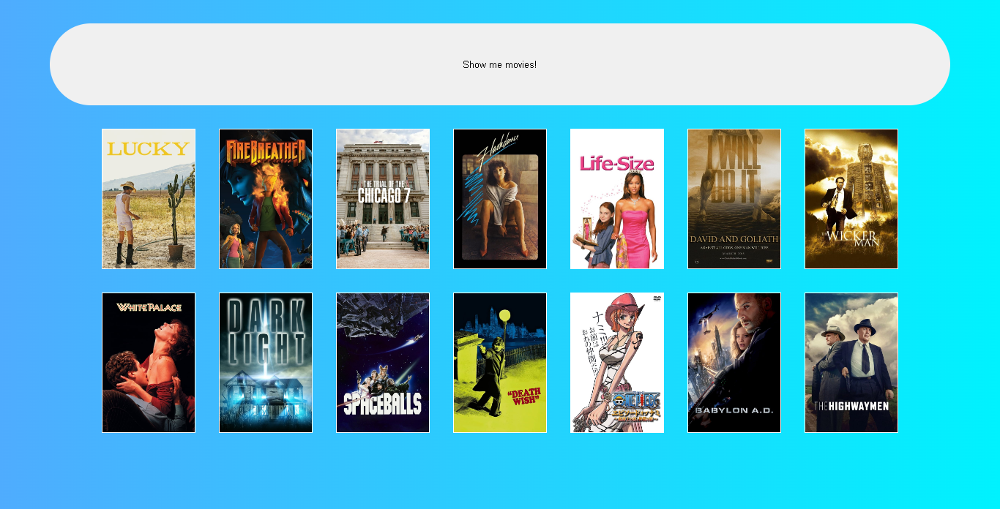

<h1 align="center"> Randomly 🎡 </h1>

## Briefing 📄

Sistema que sorteia 14 filmes aleatórios do banco de dados do TMDB.

<h2 align="left"> Objetivos 📌 </h2>

- Uso de API
- Primeiro contato com webpack e SCSS

---
<h3 align="center"> Main page 📷 </h3>

<h3 align="center"> Tecnologias utilizadas 🤖 </h3>

> 

